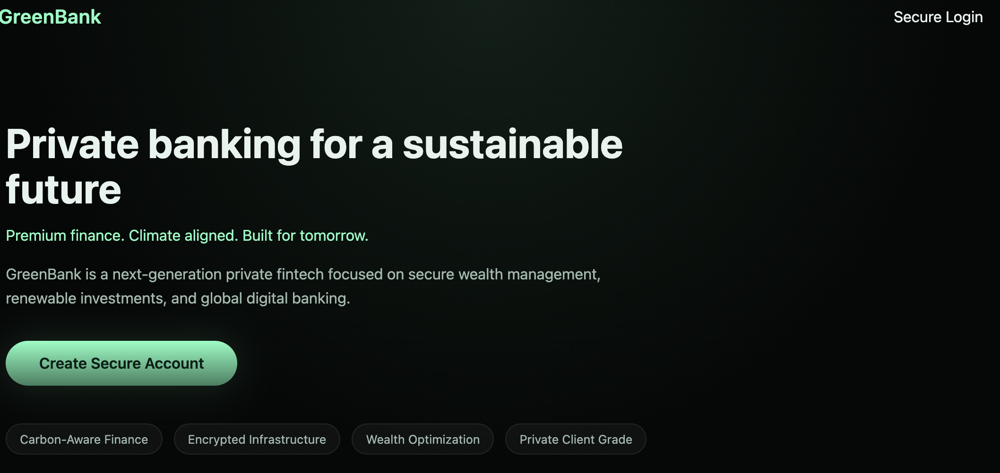

# GreenBank Simulator

A frontend-only digital banking system simulation built with HTML, CSS, and Vanilla JavaScript.

**Author:** Innocent Ikuku  
**Brand:** GreenTEK DIGITALS  
**Live Demo:** https://melodious-sunshine-7cee2d.netlify.app/
## 📸 Screenshots

### Landing Page

---

## Overview

GreenBank is a systems-level fintech simulation designed to model how a real digital bank behaves, not just how it looks.

It focuses on:

- Realistic banking flows
- Deterministic frontend state management
- Ledger-based transactions
- Session handling
- Security modeling
- Calm, trust-centered UI

This is not a static demo. It behaves like a product.

---

## About GreenTEK DIGITALS

GreenBank is a concept product under my personal brand, **GreenTEK DIGITALS**, which represents a philosophy of sustainable, long-term, and human-centered technology.

The “Green” in GreenBank reflects:

- Calm interfaces
- Clarity-first design
- Longevity over trends
- Trust-focused UX
- Minimal cognitive load

This philosophy influenced both the UI and system design.

---

## Tech Stack

- HTML5
- CSS3
- Vanilla JavaScript
- LocalStorage (mock database)
- Netlify (deployment)

No frameworks. No backend. Built from first principles.

---

## Core Features

### User System
- Registration
- Login
- Persistent sessions
- Logout handling
- Session guards

### Banking Simulation
- Checking & savings accounts
- Credits and debits
- Transfers
- Transaction history
- Activity feed

### Security Modeling
- PIN-gated sensitive actions
- Role separation logic
- Admin-style isolation patterns

### UI/UX
- Premium fintech design language
- Glassmorphism-inspired panels
- Soft green sustainability palette
- Mobile responsiveness
- Trust signals
- Clear visual hierarchy

---

## Architecture Principles

### Single Source of Truth
All UI and logic are derived from one authoritative state object.

### Ledger-Based Transactions
Balances are computed from transaction logs, not mutated directly.

### Frontend-Only, Backend-Ready
LocalStorage is used as a mock database:
greenbank_users
greenbank_current_user
greenbank_admin

The data model is structured for easy migration to a real backend later.

### Security Patterns
- Session isolation
- Role separation
- PIN-based step-up actions
- Guarded routes

---

## Developer-Focused Challenges Solved

- CSS collisions across pages
- State desynchronization
- Broken auth flows
- UI regressions
- Layout instability
- Script interference

These were resolved through architectural resets, not patching.

---

## Why This Project Matters

Most frontend demos are shallow.

GreenBank demonstrates:

- Frontend architecture
- State modeling
- UI systems thinking
- Real-world logic simulation
- Debugging discipline
- Product-level UX decisions

It shows how I think, not just what I build.

---

## Deployment

Hosted on Netlify as a static app.

Live Demo:  
https://melodious-sunshine-7cee2d.netlify.app/

---

## Roadmap

- Backend integration (Postgres / Supabase / Neon)
- API layer
- JWT authentication
- Role-based admin
- External transfers
- Statements
- Fraud flags
- Reconciliation system

---

## Final Note

GreenBank is not a finished product.  
It is a **core-banking behavior simulator**.

It reflects the GreenTEK DIGITALS philosophy:

> Sustainable technology is not just about the environment.  
> It is about building systems that last.

